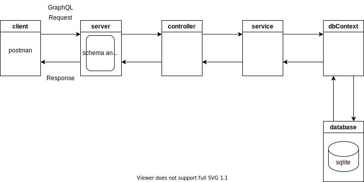

# express-js-graphql-sqlite-api

A simple api using express.js and sqlite with async/await

## Requirements

* node.js ([https://nodejs.dev/learn/making-http-requests-with-nodejs](https://))
* express.js ([https://expressjs.com/](https://))
* graphql ([https://github.com/graphql/express-graphql](https://))
* sqlite ([https://sqlite.org/index.html](https://))
* sqlite3 ([https://github.com/mapbox/node-sqlite3](https://))
* Postman (optional for testing api)
* SQLiteStudio (optional for managing database) ([https://sqlite.org/index.html](https://))

## Diagram



## Components

* **config (config.js)**

  - configuration file
* **server (server.js)**

  - creates server and listens on a port 3000
  - defines resolver (resolver.js)
* **Controller (taskController.js)**

  - handles requests
* **Service (taskService.js)**

  - handles business logic
* **Schema (taskSchema.js)**

  - defines schema for Task, Query (getall, getone) and Mutation (add, update, delete)
* **dbContext (dbContext.js)**

  - handles db connection
* **database (mongodb community server)**

  - mongodb database

## Run

Run the following command from the root directory:

```
node .\server.js
```

## Tests

Try the following urls in Postman.

* GetTasks (GET)

  * http://127.0.0.1:3000/graphql/task
  * body -> GraphQL
  ```
  query {
      getTasks {
          id
          name
          description
          priority
          status
      }
  }
  ```

* GetTask (GET)

  * http://127.0.0.1:3000/graphql/task
    * body -> GraphQL
  ```
  query {
      getTask(id:1) {
          id
          name
          description
          priority
          status
      }
  }
  ```

* AddTask (POST)

  * http://127.0.0.1:3000/graphql/task
  * body -> GraphQL
  ```
  mutation {
      addTask(name: "task2", description: "task2", priority: "low", status: "none")    
  }
  ```
* UpdateTask (POST)

  * http://127.0.0.1:3000/graphql/task
  * body -> GraphQL
  ```
  mutation {
      updateTask(id: 2, name: "task22", description: "task22", priority: "medium", status: "none")    
  }
  ```
* DeleteTask (POST)

  * http://127.0.0.1:3000/graphql/task
  * body -> GraphQL
  ```
  mutation {
      deleteTask(id:3)    
  }
  ```
